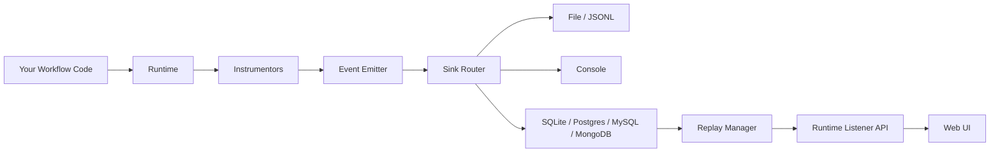

<div align="center">


# Flow Forge AI

Build, trace, and replay AI workflows with pluggable instrumentation and storage backends.

[](#installation)
[](#development)
[](#development)
[](#development)
[](#web-ui)

</div>

## Why Flow Forge AI?

Flow Forge AI gives you end-to-end observability for AI workflows by automatically tracing LLM calls, tool invocations, and HTTP interactions into structured events.

It is designed to be:

- Lightweight in app code (context manager and decorators)
- Flexible in storage (file, console, memory, SQL, MongoDB)
- Practical for debugging (runtime replay API + web UI)

## Key Capabilities

- Runtime lifecycle tracing with run-level start/end/error events
- Automatic instrumentation for OpenAI, Ollama, httpx, and requests
- Tool-level tracing via decorators
- Config-driven sink routing (single sink or fan-out to many sinks)
- Runtime replay listener with HTTP endpoints (`/api/runs`, `/api/steps`, replay controls)
- FastAPI UI for browsing runs, steps, and events

## Architecture At A Glance



## Installation

### Core

```bash
pip install -e .
```

### Optional Extras

Install only what you need:

```bash
# Instrumentors
pip install -e ".[openai-instr]"
pip install -e ".[ollama-instr]"
pip install -e ".[httpx-instr]"
pip install -e ".[langchain-instr]"

# Storage backends
pip install -e ".[sqlite-sink]"
pip install -e ".[postgres-sink]"
pip install -e ".[mysql-sink]"
pip install -e ".[mongodb-sink]"

# Web UI
pip install -e ".[ui]"

# Development tooling
pip install -e ".[dev]"
```

## Quick Start

### 1. Create configuration

```bash
cp config.example.toml config.toml
```

By default, configuration is loaded from `config.toml` in your current working directory.

### 2. Run an example

Examples are ready to run from [examples](examples):

- [examples/01_openai_context_manager/example.py](examples/01_openai_context_manager/example.py)
- [examples/02_ollama_workflow_decorator/example.py](examples/02_ollama_workflow_decorator/example.py)
- [examples/03_httpx_context_manager/example.py](examples/03_httpx_context_manager/example.py)
- [examples/04_requests_workflow_decorator/example.py](examples/04_requests_workflow_decorator/example.py)

```bash
cd examples/02_ollama_workflow_decorator
python example.py
```

### 3. Inspect runs in the Web UI

```bash
flow-forge-ai-ui
flow-forge-ai-ui --host 0.0.0.0 --port 8080
```

The UI serves on `http://127.0.0.1:8080` by default.

## Usage Pattern

### Context manager style

```python
from flow_forge_ai.runtime import runtime

with runtime.run(workflow="my-workflow") as run_id:
	# Any instrumented calls inside this block are traced
	print(f"run_id={run_id}")
```

### Decorator style

```python
from flow_forge_ai.instrumentation.workflow import workflow

@workflow(workflow_id="my-pipeline")
def pipeline():
	return "done"

pipeline()
```

### Tool tracing decorator

```python
from flow_forge_ai.instrumentation.trace_tool import trace_tool

@trace_tool(version="v1")
def enrich(data: dict) -> dict:
	return {"ok": True, **data}
```

## Configuration Overview

Core sections:

- `[runtime]`: listener and replay source settings
- `[[instrumentors]]`: which libraries to auto-instrument
- `[[sinks]]`: where events are written

Minimal example:

```toml
[runtime]
enabled = true
source_sink = "file log"
listener_host = "127.0.0.1"
listener_port = 7070

[[instrumentors]]
class_path = "flow_forge_ai.instrumentation.requests_instr.RequestsInstrumentor"

[[sinks]]
name = "file log"
class_path = "flow_forge_ai.sinks.file_sink.FileSink"

[sinks.options]
class_path = "flow_forge_ai.sinks.handlers.jsonl_handler.JsonlHandler"
path = "./traces.jsonl"
```

Start from [config.example.toml](config.example.toml) for a full template.

## Using `env:` In Sink Options

Sink options support environment-variable expansion when values are prefixed with `env:`.

This is useful for secrets such as DB passwords and usernames.

Example:

```toml
[[sinks]]
name = "postgres log"
class_path = "flow_forge_ai.sinks.database_sink.DatabaseSink"

[sinks.options]
class_path = "flow_forge_ai.sinks.handlers.postgres_handler.PostgresHandler"
host = "127.0.0.1"
port = 5432
database = "flow_forge"
user = "env:FLOW_FORGE_DB_USER"
password = "env:FLOW_FORGE_DB_PASSWORD"
```

At load time, values prefixed with `env:` are replaced by `os.getenv(<name>)`.

## Supported Instrumentors

- `flow_forge_ai.instrumentation.openai_instr.OpenAIInstrumentor`
- `flow_forge_ai.instrumentation.ollama_instr.OllamaInstrumentor`
- `flow_forge_ai.instrumentation.httpx_instr.HttpxInstrumentor`
- `flow_forge_ai.instrumentation.requests_instr.RequestsInstrumentor`

All instrumentors are config-driven through `[[instrumentors]]` and can receive options via `[instrumentors.options]`.

## Supported Sinks

- `flow_forge_ai.sinks.file_sink.FileSink`
- `flow_forge_ai.sinks.console_sink.ConsoleSink`
- `flow_forge_ai.sinks.memory_sink.MemorySink`
- `flow_forge_ai.sinks.database_sink.DatabaseSink`

`DatabaseSink` supports pluggable resource handlers via `sinks.options.class_path`:

- `flow_forge_ai.sinks.handlers.jsonl_handler.JsonlHandler`
- `flow_forge_ai.sinks.handlers.sqlite_handler.SQLiteHandler`
- `flow_forge_ai.sinks.handlers.postgres_handler.PostgresHandler`
- `flow_forge_ai.sinks.handlers.mysql_handler.MySQLHandler`
- `flow_forge_ai.sinks.handlers.mongodb_handler.MongoDBHandler`

## Runtime Replay API

When `[runtime].enabled = true`, Flow Forge AI starts a local listener exposing replay/run endpoints used by the UI:

- `GET /api/runs`
- `GET /api/steps?run_id=<run_id>`
- `POST /api/runs/{run_id}/replay`
- `GET /api/runs/{run_id}/replay`
- `DELETE /api/runs/{run_id}/replay`

## Web UI

Launch the UI after installing the `ui` extra:

```bash
flow-forge-ai-ui
```

The app serves on `http://127.0.0.1:8080` by default.

## Development

Install development dependencies:

```bash
pip install -e ".[dev]"
```

Run tests:

```bash
pytest
```

Run tests with coverage:

```bash
pytest --cov=flow_forge_ai --cov-report=term-missing --cov-report=xml
```

Type checking:

```bash
pyright
```

Lint:

```bash
brew install enchant
pylint ./src
```

## Project Layout

- [src/flow_forge_ai](src/flow_forge_ai): runtime, config, sinks, instrumentation, replay
- [src/flow_forge_ai_ui](src/flow_forge_ai_ui): FastAPI web UI
- [examples](examples): runnable end-to-end scenarios
- [tests](tests): unit, integration, and e2e coverage

## Notes On Live GitHub Badges

The badges above describe the stack used in this repository.

If you add GitHub Actions and Codecov, you can switch to live status badges such as:

- `https://img.shields.io/github/actions/workflow/status/<owner>/<repo>/ci.yml?label=tests`
- `https://img.shields.io/codecov/c/github/<owner>/<repo>?label=coverage`

