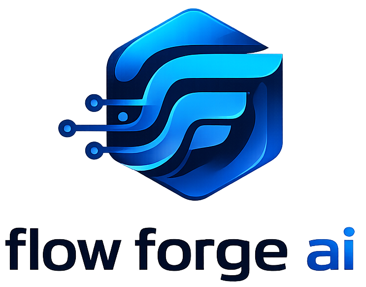
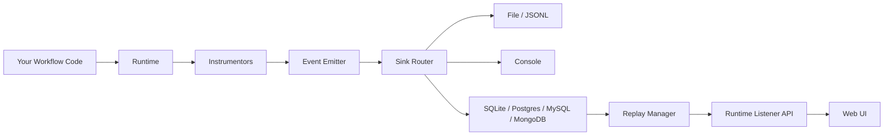

<div align="center">



# Flow Forge AI

Build, trace, and replay AI workflows with pluggable instrumentation and storage backends.

[](https://github.com/alonzo86/flow-forge-ai/releases)
[](https://github.com/alonzo86/flow-forge-ai/releases)
[](#packages)
[](#packages)
[](#development)
[](https://codecov.io/gh/alonzo86/flow-forge-ai)
[](#development)
[](#packages)
[](https://alonzo86.github.io/flow-forge-ai/)

</div>

## Overview

Flow Forge AI is a monorepo that provides end-to-end observability for AI workflows. It automatically traces LLM calls, tool invocations, and HTTP interactions into structured events, then lets you browse and replay them through a web UI.

## Packages

| Package | Description | Docs |
|---------|-------------|------|
| [`flow-forge-ai`](core/) | Core runtime, instrumentation, and storage | [core/README.md](core/README.md) |
| [`flow-forge-ai-ui`](ui/) | FastAPI web UI for browsing and replaying runs | [ui/README.md](ui/README.md) |

## Architecture



## Quick Start

### 1. Install

```bash
# From the core package directory
cd core
pip install -e ".[openai-instr,sqlite-sink,ui]"
```

### 2. Configure

```bash
cp config.example.toml config.toml
```

### 3. Run an example

```bash
cd core/examples/02_ollama_workflow_decorator
python example.py
```

### 4. Browse runs in the UI

```bash
flow-forge-ai-ui
```

Open `http://127.0.0.1:8080` in your browser.

## Repository Layout

```
flow-forge-ai/
├── config.example.toml    # Reference configuration template
├── core/                  # flow-forge-ai package (runtime, instrumentation, sinks)
│   ├── src/flow_forge_ai/
│   ├── examples/          # Runnable end-to-end scenarios
│   └── tests/
└── ui/                    # flow-forge-ai-ui package (FastAPI web UI)
    ├── src/flow_forge_ai_ui/
    └── tests/
```

## Development

Each package is developed independently. From the package directory:

```bash
# Install dev dependencies
pip install -e ".[dev]"

# Run tests
pytest

# Run tests with coverage
pytest --cov=flow_forge_ai --cov-report=term-missing

# Type checking
pyright

# Lint
pylint ./src
```

See [core/README.md](core/README.md) and [ui/README.md](ui/README.md) for package-specific details.
