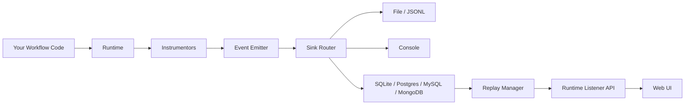

# Flow Forge AI

Build, trace, and replay AI workflows with pluggable instrumentation and storage backends.

[](#packages)
[](#packages)
[](#packages)
[](https://codecov.io/gh/alonzo86/flow-forge-ai)

## Overview

Flow Forge AI is a monorepo that provides end-to-end observability for AI workflows. It automatically traces LLM calls, tool invocations, and HTTP interactions into structured events, then lets you browse and replay them through a web UI.

## Packages

| Package | Description |
|---------|-------------|
| `flow-forge-ai` | Core runtime, instrumentation, and storage |
| `flow-forge-ai-ui` | FastAPI web UI for browsing and replaying runs |

## Architecture



## Repository Layout

```
flow-forge-ai/
├── config.example.toml    # Reference configuration template
├── core/                  # flow-forge-ai package (runtime, instrumentation, sinks)
│   ├── src/flow_forge_ai/
│   ├── examples/          # Runnable end-to-end scenarios
│   └── tests/
└── ui/                    # flow-forge-ai-ui package (FastAPI web UI)
    ├── src/flow_forge_ai_ui/
    └── tests/
```
