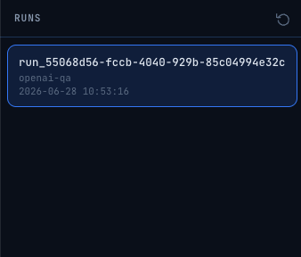
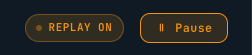

# Web UI

The `flow-forge-ai-ui` package is a lightweight FastAPI application for browsing and replaying workflow runs recorded by the core runtime.

## Requirements

- `flow-forge-ai` installed and configured with `[runtime].enable = true`
- The runtime listener must be reachable at the configured `listener_host:listener_port`

## Installation

```bash
pip install flow-forge-ai[ui]
```

Or install the UI package directly:

```bash
pip install flow-forge-ai-ui
```

## Starting the UI

```bash
flow-forge-ai-ui
```

By default the server listens on `http://127.0.0.1:8080`.

### Options

```
flow-forge-ai-ui --host 0.0.0.0 --port 9090
```

| Flag | Default | Description |
|------|---------|-------------|
| `-H` / `--host` | `127.0.0.1` | Bind address |
| `-p` / `--port` | `8080` | Port |

## Configuration

The UI reads `config.toml` from the **current working directory** (the same file used by the core runtime). It uses the `[runtime]` section to locate the listener:

```toml
[runtime]
enable = true
listener_host = "127.0.0.1"
listener_port = 7070
```

Make sure the runtime listener is started before opening the UI. The core package starts the listener automatically when a workflow run begins.

## Usage

1. Start your workflow in one terminal (the core runtime listener starts automatically):

   ```bash
   cd core/examples/02_ollama_workflow_decorator
   python example.py
   ```

2. In another terminal, start the UI from the directory containing `config.toml`:

   ```bash
   flow-forge-ai-ui
   ```

3. Open `http://127.0.0.1:8080` in your browser.

## Screenshots

### Run list



### Run detail / steps


### Replay




## API Routes

The UI is a thin FastAPI app that proxies requests to the core runtime listener.

| Method | Path | Description |
|--------|------|-------------|
| `GET` | `/` | Main UI page (HTML) |
| `GET` | `/api/runs` | Proxy: list runs |
| `GET` | `/api/steps` | Proxy: list steps for a run |
| `POST` | `/api/runs/{run_id}/replay` | Proxy: start replay |
| `GET` | `/api/runs/{run_id}/replay` | Proxy: get replay status |
| `DELETE` | `/api/runs/{run_id}/replay` | Proxy: stop replay |

## Package Layout

```
ui/src/flow_forge_ai_ui/
├── app.py          # FastAPI app factory and CLI entry point
├── routes.py       # Route handlers and runtime proxy client
├── templates/      # Jinja2 HTML templates
└── static/         # JS and static assets
```
